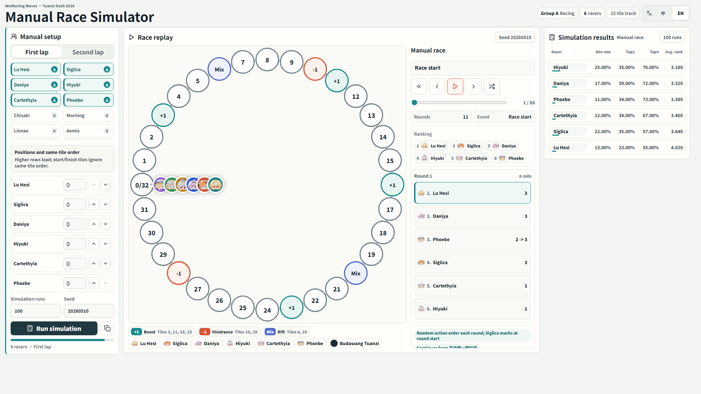

# Wuthering Waves Tuanzi Dash Local Simulator

A backend-free Monte Carlo simulator for Wuthering Waves' "Tuanzi Dash
Championship". It runs entirely in the browser, with batch simulations handled
by a Web Worker.

Live demo: https://wuthering-waves-tuanzi-sim.cristy.workers.dev/



## Features

- Manual race setup with selectable racers, lap mode, starting positions, and same-tile order.
- Configurable simulation run count and random seed.
- Browser-local result statistics, including win rate, average rank, qualification rate, and points.
- SVG replay samples with playback, step controls, and sample switching.
- Shareable links for the current setup.
- Chinese and English interface support.

## Tech Stack

- Vite
- React
- TypeScript
- Web Worker
- SVG

## Development

```powershell
npm install
npm run dev
```

Default local URL:

```text
http://localhost:5173/
```

## Build

```powershell
npm run build
```

The production build is written to `dist/`.

## Test

```powershell
npm test
```

## Data

The default race configuration is loaded from:

```text
data/tuanzi_championship_2026.json
```

## License

This project is open source under the [MIT License](https://opensource.org/licenses/MIT).
